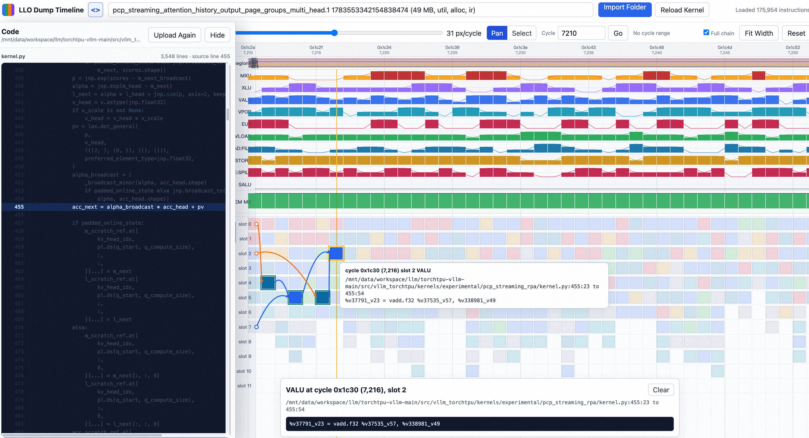
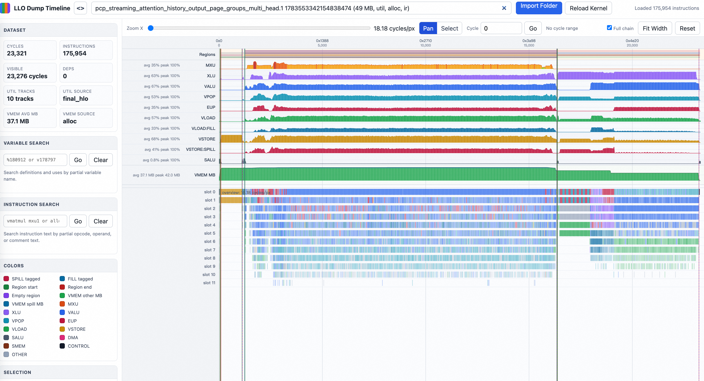

# LLO Dump Timeline Prototype

Open `index.html` in a Chromium-based browser, then choose the LLO dump folder with `Import Folder`.

For a quick local demo, choose the `simple_data` directory in this repository with `Import Folder`. It contains a small sample dump that can be loaded directly in the viewer.

The page looks for these files per kernel group:

- `*-final_bundles.txt`: cycle timeline and instruction blocks
- `*-final_hlo-static-per-bundle-utilization.txt`: hardware utilization rows when present
- `*-post-llo-dependency-graph-optimizations.txt`: discovered for context, not required by the first parser

## Collecting LLO dumps with source line annotations

Set `LIBTPU_INIT_ARGS` before JAX initializes the TPU backend. The minimal
flags needed to dump LLO and show Python source locations directly in
`*-final_bundles.txt` are:

```bash
DUMP_DIR=/tmp/llo_dump
mkdir -p "${DUMP_DIR}"

export LIBTPU_INIT_ARGS="${LIBTPU_INIT_ARGS:-} \
  --xla_jf_dump_to=${DUMP_DIR} \
  --xla_mosaic_enable_llo_source_annotations=true"
```

`--xla_mosaic_enable_llo_source_annotations=true` is the important source
annotation flag. Set it explicitly instead of relying on its `auto` setting.
With it enabled, final bundles contain native annotations such as:

```text
loc("/path/to/kernel.py":106:8 to :38)
```

For the utilization files and additional compiler context used by this
viewer, the full collection configuration used by `example_data` is:

```bash
export LIBTPU_INIT_ARGS="${LIBTPU_INIT_ARGS:-} \
  --xla_jf_dump_to=${DUMP_DIR} \
  --xla_mosaic_enable_llo_source_annotations=true \
  --xla_mosaic_enable_dump_debug_info=true \
  --xla_jf_collect_llo_stack_trace=true \
  --xla_jf_debug_level=2 \
  --xla_tpu_include_hlo_statistics_in_llo_dump \
  --xla_tpu_impure_track_debug_metadata \
  --xla_jf_log_scopes \
  --xla_jf_line_info_in_symbol_table \
  --xla_jf_emit_annotations \
  --xla_jf_module_tracemarks \
  --xla_jf_dump_debug_info \
  --xla_tpu_add_llo_regions_to_symbol_table \
  --xla_tpu_use_enhanced_launch_barrier=true \
  --xla_jf_lsra_v2_annotate"
```

`--xla_jf_line_info_in_symbol_table` is different from the Mosaic source
annotation flag: it adds `FileNames`, `FileLocations`, and `StackFrames`
tables to the top-level HLO dump, but does not by itself place readable
Python locations on final-bundle instructions.

See
[`example_data/bench_pcp_q_compute_micro.py`](example_data/bench_pcp_q_compute_micro.py)
for a programmatic setup that safely appends these flags before TPU backend
initialization.

Dependency arrows are inferred in layers:

- SSA data dependencies from `%id` use-def chains
- exact memory dependencies for static `space:[#allocation + offset]` references
- conservative memory dependencies for dynamic addresses
- DMA/semaphore dependencies from `dma.general`, `dma.done`, and semaphore-like ops when resolvable
- control/order dependencies where the text makes a conservative relationship visible

Use the zoom slider or Ctrl+wheel over the canvas to zoom the cycle axis. Blocks show only color when compact, hardware labels when wider, and short instruction labels when there is enough room.

## Examples





## Tests

Run the browser regression suite with:

```bash
npm test
```

The tests generate a small synthetic LLO dump in a temporary directory and open `index.html?test=1` with Playwright. They cover kernel fuzzy search and size ordering, keyboard/slider/wheel zoom and pan, color legend dimming, utilization stats and selected-range recomputation, empty-cycle utilization alignment, code drawer file management and column highlighting, and pinned dependency roots.
